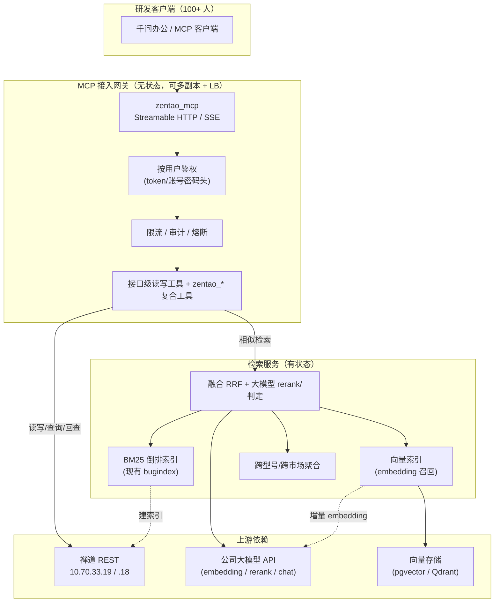

# 禅道 MCP 服务内网部署方案设计

> 版本：v1.0　｜　适用对象：公司内网研发（100+ 人）　｜　接入方式：千问办公类 MCP 客户端
>
> 设计原则：**最大化复用现有 `zentao_mcp` 仓库能力，只在必要处做增量**。三个目标功能里，任务/Bug 读写与查询已由现网代码覆盖，本方案的重点是第 3 点「跨型号 / 跨市场相似 Bug 检索与定位」，以及支撑 100+ 人规模的工程化加固。

---

## 一、目标与范围

| # | 目标功能 | 现状 | 本方案增量 |
|---|---|---|---|
| 1 | 禅道任务、Bug 的创建 / 处理 | ✅ 已具备：OpenAPI 自动生成的接口级工具（可读写），能建/完成任务、建/解决 Bug | 权限收口、写操作审计、限流 |
| 2 | 查询禅道任务 / Bug | ✅ 已具备：`zentao_search_bugs`、`zentao_analyze_bug`、`zentao_quality_report` 等 7 个只读复合工具 | 无需重写，纳入统一网关与监控 |
| 3 | 检索目录 + 模型能力，快速判断当前 Bug 是否在**其他型号 / 其他市场**出现过，快速定位 | ⚠️ 部分具备：`zentao_find_similar_bugs` 已有进程内 BM25+CJK 二元索引，但**只做词面相似，不做语义、不做跨型号聚合、未接大模型** | **核心增量**：混合检索（BM25 召回 + 向量语义召回 + 大模型 rerank/判定）+ 跨型号跨市场聚合视图 |

**不在本方案范围内**（明确边界，避免误解）：

- **写备注 / AI 评分回填**：禅道 v1 REST 无备注写入接口，只能走网页端点 `action-comment-{type}-{id}.html`，这属于 `zentao_tool` 的职责，MCP 服务不承担。
- **删除生产数据**：正式库 `block: [DELETE]` 已禁用，保持。

---

## 二、现状盘点（复用清单）

现有仓库 `D:\code_CPL\zentao_mcp`（Go 1.24，MCP go-sdk）已实现并实测：

**传输与接入**
- 双协议：Streamable HTTP（`POST /{name}/mcp`）与 SSE（`GET|POST /{name}/sse`），千问办公类客户端直连即可。
- 多服务：单实例同时代理正式库 `zentao`（10.70.33.19）与沙箱 `zentao-sandbox`（10.70.33.18）。

**鉴权**
- `ZentaoTokenManager`：按「账号+密码」在内存缓存 token；401 时 `Refresh` 复用他人已换新的 token，避免并发 401 各自登录；登录失败按凭据指数退避（15s→10min），修复了「登录风暴锁号」问题。
- 支持 `zentao-account/zentao-password` 或 `token` 请求头，服务端自动登录并缓存。

**检索底座（`internal/service/bugindex`）**
- 零外部依赖的进程内倒排索引：CJK 切重叠二元字组、英数型号整串保留（`DCMG150` 不切碎）、BM25 打分。
- 排序 = BM25 × 已修复 1.35 × codeerror 1.15 × 型号/省份精确命中 1.6，标题词权重 ×2。
- 已把标题里的 `【】` 抽成 facet（本语料 81% 的 Bug 带此标签，正是**设备型号 / 省份 / 运营商**）——这是「跨型号跨市场」聚合的天然抓手。
- 权限模型：索引由服务账号（admin）构建、装其可见全部内容；**查询结果绝不直接取自索引**，每条候选用调用者自己凭据回查，禅道 12.3 用 HTTP 400 表示「无权/已删」，读不到即丢弃、只报数量。
- 实测规模：67,016 条 Bug / 623 产品，8 路并发建索引约 2 分钟，常驻内存约 380MB，默认 6h 全量重建，**不落盘**（重启即重建）。

**已知约束（需在方案中处理）**
- 单产品抓取上限 `max_bugs_per_product: 5000`，且 `listAll` 受 maxPages×pageSize 硬上限约束，按 `id_desc` 抓取——**超限会静默丢弃最老的 Bug**。
- 索引不落盘 → 每次重启有约 2 分钟「召回为空」窗口。
- 相似检索是**词面**相似，同义/跨语言/换一种说法描述同一问题会漏召——这正是第 3 点要接大模型的原因。

---

## 三、总体架构

分三层：**MCP 接入网关**（无状态，横向扩展）→ **检索服务**（有状态，承载索引与向量）→ **上游依赖**（禅道 REST + 公司大模型 API）。100+ 人规模下，把检索从网关进程里拆出来是关键演进（P2），让索引重建、embedding 生成不与请求争抢资源，并可独立扩缩容。



**数据流（相似 Bug 定位一次问答）：**
1. 用户在客户端描述现象（或给 bugID）→ 网关 `zentao_find_similar_bugs`（增强版）。
2. 检索服务并行两路召回：BM25（现有）+ 向量（新）。RRF 融合出 Top-K 候选。
3. 候选逐条用**调用者凭据**回查禅道（沿用现有权限模型），无权读的丢弃。
4. 存活候选交大模型 API 做 rerank + 「是否同一类问题」判定，并按型号/市场 facet 聚合。
5. 返回：跨型号/跨市场命中矩阵 + 每条历史 Bug 的解决说明（`fixNote`）+ 大模型给出的根因假设与定位建议。

---

## 四、检索方案选型（你让我给建议的部分）

### 4.1 三种方案对比

| 维度 | A. 纯 BM25（现状） | B. 纯向量语义 | C. 混合检索（BM25 + 向量 + 大模型 rerank）★推荐 |
|---|---|---|---|
| 型号/省份精确命中 | 强（已 ×1.6 boost） | 弱（embedding 会稀释型号串） | 强（BM25 保留精确命中） |
| 同义/换种说法/跨语言 | 弱（漏召） | 强 | 强 |
| 外部依赖 | 无 | embedding 模型 + 向量库 | embedding + 向量库 + rerank/chat |
| 冷启动/运维成本 | 极低 | 中 | 中高 |
| 可解释性 | 高（命中词可见） | 低 | 高（保留命中词 + 模型给理由） |
| 大模型 API 挂了 | 不受影响 | 不可用 | **可降级到 A** |

### 4.2 推荐：分阶段落地的混合检索（C），但不推翻现有 A

**理由：** 你的语料有两个强特征——① 型号/省份/运营商写在 `【】` 里且 81% 覆盖，词面精确匹配价值极高；② 但「同一问题不同人换种说法描述」正是 BM25 的盲区，也是你要「调用模型能力」的初衷。纯向量会丢掉①，纯 BM25 补不上②。混合检索用 BM25 守住精确命中、用向量补语义召回、用大模型做最后一层「是不是同一个问题」的判定，恰好覆盖「跨型号跨市场快速定位」的完整诉求。

**关键设计：大模型 API 是增强项而非依赖项。** 向量召回与 rerank 失败时，工具自动降级为现有 BM25 结果并在 `notes` 标注「语义增强不可用」，保证第 3 点功能永远可用。

### 4.3 向量层选型（67k 条属小语料）

| 选项 | 适用 | 说明 |
|---|---|---|
| **pgvector**（推荐，若已有/可上 Postgres） | 100+ 人、需持久化与 HA | 67k×1024 维仅数百 MB，HNSW 索引查询 <10ms；embedding 落库，重启不必重算，解决现有「不落盘、重启 2 分钟空窗」痛点 |
| Qdrant / Milvus（独立向量服务） | 未来语料涨到百万级 | 独立扩缩容，运维更重，当前规模没必要 |
| sqlite-vec / 进程内 HNSW | 想保持「零外部依赖」哲学 | 与现有 bugindex 同进程，但持久化与多副本共享较弱 |

**推荐 pgvector**：67k 规模绰绰有余，且天然解决持久化、多网关副本共享同一份向量、以及 embedding 增量更新。

### 4.4 Embedding 生成策略（控成本/控时延）

- **增量优先**：沿用现有 `MaxID()` 机制，只对新增/变更 Bug 生成 embedding，避免每次全量重算 67k 条。
- **持久化缓存**：embedding 存 pgvector，与 Bug 内容 hash 绑定；内容没变不重算。
- **批量调用**：首次回填按批（如 64 条/批）并发调用公司 embedding API，带限流与重试。
- **降级**：embedding API 不可用时，该批跳过、标记待补，不影响 BM25 主链路。

---

## 五、大模型 API 集成设计

三个调用点，职责分离，全部可独立降级：

| 调用点 | 模型能力 | 位置 | 失败降级 |
|---|---|---|---|
| 向量化 | embedding | 检索服务，索引构建/增量时 | 跳过该批，退回 BM25 |
| 重排/判定 | rerank 或 chat | 检索服务，融合后对 Top-K | 用 RRF 融合分直接返回 |
| 定位建议 | chat | 复合工具，聚合后 | 只返回结构化命中矩阵，不生成自然语言结论 |

**工程要点：**
- **调用位置放在检索服务、不放网关**：让慢的模型调用与快的 MCP 请求解耦，网关不被模型时延拖垮。
- **超时与熔断**：每次模型调用设超时（如 embedding 10s、rerank 8s、chat 20s），连续失败触发熔断，一段时间内直接走降级路径，避免雪崩。
- **成本控制**：rerank/chat 只作用于 Top-K（建议 K≤20），不对全量候选调用；结果可按「查询文本 hash + 候选 id 集合」做短期缓存。
- **提示词设计（判定「是否同一问题」）**：给模型输入 = 当前现象 + 候选历史 Bug 的标题/重现步骤摘要/解决说明，要求输出：是否同类（是/否/存疑）、共同根因假设、受影响型号与市场列表、建议排查方向。**要求模型对证据不足的点标「待确认」**，与现有 `zentao_analyze_bug` 的 `analysisChecklist` 风格一致，避免臆测根因。

### 5.1 跨型号 / 跨市场定位（第 3 点的核心交付）

新增/增强一个复合工具（建议命名 `zentao_diagnose_bug`，或给 `zentao_find_similar_bugs` 加 `explain=true` 模式）：

1. 检索得到 Top-K 相似历史 Bug（混合召回）。
2. 用现有 facet 抽取能力，把每条命中的 **型号（`【】` 内设备型号）/ 市场（省份、运营商）/ 产品名** 结构化。
3. 生成**跨型号跨市场命中矩阵**：
   - 行 = 型号，列 = 市场/省份，单元格 = 命中数 + 代表性 Bug id + 是否已修复。
   - 一眼看出「这个问题是不是只在某型号某省出现，还是跨型号普遍存在」。
4. 对最像的 1-3 条自动串 `zentao_analyze_bug` 取完整时间线与 `fixNote`（当时的解决说明）。
5. 大模型综合输出：**根因假设 + 影响范围（型号/市场）+ 历史修复方案 + 建议定位步骤**。

这一步把「检索目录 + 模型能力 + 快速定位」三个诉求拧成一个可交付的问答闭环。

---

## 六、多用户鉴权与权限模型（100+ 人）

- **沿用现有按调用者凭据逐条回查模型**：这是本方案最重要的安全资产，务必保留。索引装服务账号（admin）的全量可见内容，但任何返回给用户的数据都用**该用户自己的凭据**重新读一次，读不到（禅道返回 400）即丢弃、只报 `hiddenByPermission` 数量。→ 服务账号可见范围越广召回越好，而用户永远只能看到自己有权看的记录。
- **凭据来源**：客户端请求头带 `zentao-account/zentao-password` 或 `token`。**强烈建议用 token 而非明文密码**（千问办公类客户端配置 header 即可），减少密码在内网流转。
- **token 缓存隔离**：现有 `ZentaoTokenManager` 按账号缓存、并发 401 复用、失败退避，天然适配多用户；100+ 人下注意缓存条目增长，加 TTL 与容量上限（见风险项）。
- **服务账号保护**：`admin` 口令仅经 `.env`（权限 600）注入 `ZENTAO_INDEX_PASSWORD`，不进镜像、不进仓库。

---

## 七、部署架构

### 7.1 阶段一（P0/P1）：单机 Docker，快速上线

沿用现有 `docker-compose.yml`，单台内网服务器：
- 网关 + 检索（进程内 bugindex）同容器，pgvector 起一个独立容器。
- 正式库 `zentao` 只读+受控写、禁用 DELETE；沙箱 `zentao-sandbox` 放开写供演练。
- 资源基线：≥4 核 / 8GB（索引常驻 ~380MB + 向量 + 并发回查），系统盘留足。

### 7.2 阶段二（P2）：网关多副本 + 检索服务独立

- **网关无状态多副本**，前置内网 Nginx/LB，支撑 100+ 人并发。
- **检索服务独立**（BM25 + pgvector + 模型调用），网关通过内网 gRPC/HTTP 调用；索引重建、embedding 回填不影响请求。
- **向量与 embedding 持久化在 pgvector**，多副本共享同一份，消除「重启 2 分钟空窗」。

```
研发客户端 → 内网 LB(Nginx) → [网关副本 ×N] → 禅道 REST(.19/.18)
                                   ↓
                            [检索服务] → pgvector(Postgres)
                                   ↓
                             公司大模型 API
```

### 7.3 网络与前置条件
- 目标服务器 ↔ 禅道服务器（10.70.33.19/.18）网络已联通（你已确认）。
- 新增连通性需求：**目标服务器 ↔ 公司大模型 API 网关**、**↔ Postgres/pgvector**（若独立部署）需放通防火墙。
- 全内网，数据不出网；大模型走公司内网 API，符合安全边界。

---

## 八、性能、并发与限流

- **并发瓶颈在「逐条回查」**：每次相似检索要对 Top-K 候选各发一次禅道读请求（且按 8 倍超取分批）。100+ 人下需给回查加并发池上限与单请求超时，避免打爆禅道。
- **限流**：网关按用户/客户端加 QPS 限流（如每用户 5 QPS、全局 200 QPS），写操作单独更严配额。
- **慢查询保护**：无 ID 的全产品扫描约 50s，应在工具层引导先用 `zentao_resolve_scope` 拿 ID，并对无范围扫描设 `maxScan` 与超时。
- **模型调用配额**：embedding/rerank/chat 各自限流 + 熔断（见五）。

---

## 九、可观测性与运维

- 现有内置 OpenTelemetry 链路追踪与指标，接公司监控（Prometheus/Grafana）。
- **必须监控的指标**：索引文档数与 `builtAt`（是否 stale）、建索引耗时、内存占用、每工具调用量与 P95 时延、禅道回查失败率（400/401/超时）、模型 API 时延与降级次数、限流触发数、登录退避次数（锁号预警）。
- **健康检查**：⚠️ 现有 `docker-compose.yml` healthcheck 打的是 `127.0.0.1:8080/healthz`，但服务监听 `:7892`（`config.yaml` `port: ":7892"`）——**端口不一致，健康检查会一直失败**，部署前需修正为 7892。
- **告警**：索引超过 2×refresh 周期未更新、内存超阈值、模型降级率突增、某账号登录退避频繁 → 告警。

---

## 十、安全与合规

- 生产数据只在内网流转；大模型调用走公司内网 API，Bug 内容不出网。
- 服务账号口令仅经 `.env`(600) 注入，禁止入库/入镜像。
- 写操作（建/完成任务、建/解决 Bug）全量审计：谁、何时、对哪个对象、改了什么。
- 正式库禁 DELETE 保持不变；沙箱用于写演练。
- 敏感字段（如口令）在日志中脱敏。

---

## 十一、落地路线图

| 阶段 | 目标 | 主要工作 | 依赖 |
|---|---|---|---|
| **P0（1 周）** | 现网能力上线给研发用 | 修正 healthcheck 端口；单机 Docker 部署网关+现有 bugindex；接公司监控；发放客户端接入配置（token 头）；写操作审计与限流 | 目标服务器、禅道连通（已具备） |
| **P1（2-3 周）** | 语义检索增强 | 接公司大模型 embedding API；上 pgvector；增量 embedding + 持久化；混合召回（BM25+向量 RRF）；大模型 rerank/判定；全链路降级 | 大模型 API、Postgres/pgvector |
| **P2（2-3 周）** | 跨型号跨市场定位 + 规模化 | `zentao_diagnose_bug`（命中矩阵 + 根因假设 + 修复方案）；检索服务从网关拆出；网关多副本 + LB；并发/限流加固 | P1 完成 |
| **P3（持续）** | 调优 | 检索质量评测集、rerank 阈值调参、embedding 模型选型对比、成本优化 | 使用数据积累 |

---

## 十二、风险与注意事项

1. **5000 条/产品上限会丢最老 Bug**：`max_bugs_per_product: 5000` + `listAll` 按 `id_desc` 抓取，老 Bug 静默不进索引。需先查各产品 Bug `total`，对超限产品提高上限或分时间窗抓取，否则「历史上是否出现过」会漏掉最老的证据。
2. **索引不落盘 → 重启空窗**：现有 bugindex 重启需约 2 分钟重建。P1 的 pgvector 持久化可解决向量部分；BM25 部分可考虑落盘快照或启动预热。
3. **大模型 API 成为新依赖**：必须实现全链路降级（五、4.2），否则模型侧抖动会让第 3 点功能不可用。
4. **逐条回查放大禅道压力**：100+ 人并发下回查请求量可观，需并发池 + 超时 + 缓存，避免拖垮禅道。
5. **token 缓存无上限**：`ZentaoTokenManager` 的 `tokens`/`failures` map 随账号增长，长期运行需加 TTL 与容量淘汰。
6. **healthcheck 端口 bug**（见九），部署前必修。
7. **embedding 首次回填成本**：67k 条首次向量化需评估公司 API 配额与耗时，建议错峰、分批、可断点续跑。

---

## 十三、附录：配置增量样例

在现有 `config.yaml` 的 `zentao` server 下扩展（示意，字段名以实现为准）：

```yaml
servers:
  - name: zentao
    base_url: "http://10.70.33.19/biz/api.php/v1"
    zentao_extensions: true
    bug_index:
      enabled: true
      account: "admin"
      password_env: "ZENTAO_INDEX_PASSWORD"
      refresh: "6h"
      max_products: 700
      max_bugs_per_product: 8000   # ← 按实测 total 提高，避免丢老 Bug
      # —— P1 新增：语义增强 ——
      semantic:
        enabled: true
        embedding_api: "http://<公司大模型网关>/embeddings"
        embedding_model: "<公司embedding模型名>"
        rerank_api: "http://<公司大模型网关>/rerank"
        chat_api: "http://<公司大模型网关>/chat"
        vector_store: "postgres://<pgvector-dsn>"
        top_k: 20
        timeout_ms: { embedding: 10000, rerank: 8000, chat: 20000 }
        degrade_to_bm25: true      # ← 模型不可用时自动降级
    block:
      - methods: ["DELETE"]
        regex: ".*"
```

客户端接入（千问办公类 MCP 客户端，token 头方式）：

```json
{
  "mcpServers": {
    "zentao": {
      "type": "mcp",
      "url": "http://<内网服务地址>:7892/zentao/mcp",
      "headers": { "token": "<用户自己的禅道 token>" }
    }
  }
}
```

---

**一句话总结：** 底座已现成，P0 先把现有能力按 100+ 人规模工程化上线（修 healthcheck、加限流/审计/监控），P1 用公司大模型 API + pgvector 把词面检索升级为可降级的混合语义检索，P2 交付「跨型号跨市场命中矩阵 + 根因假设 + 历史修复方案」的定位闭环并把检索服务独立、网关多副本。
